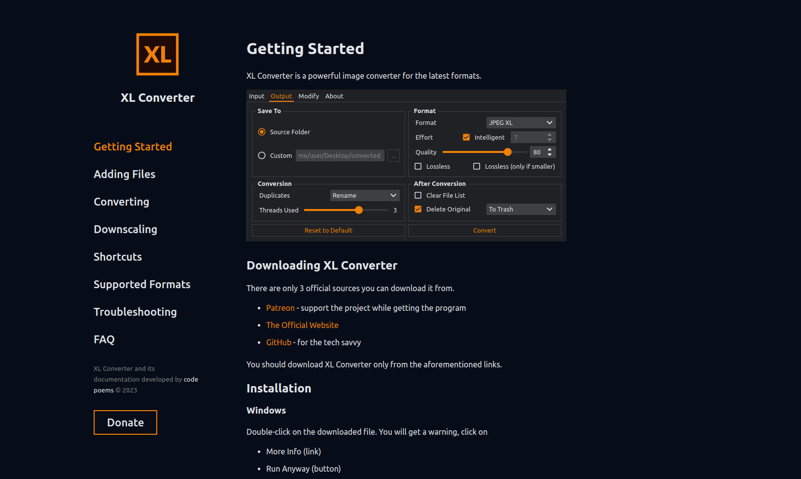
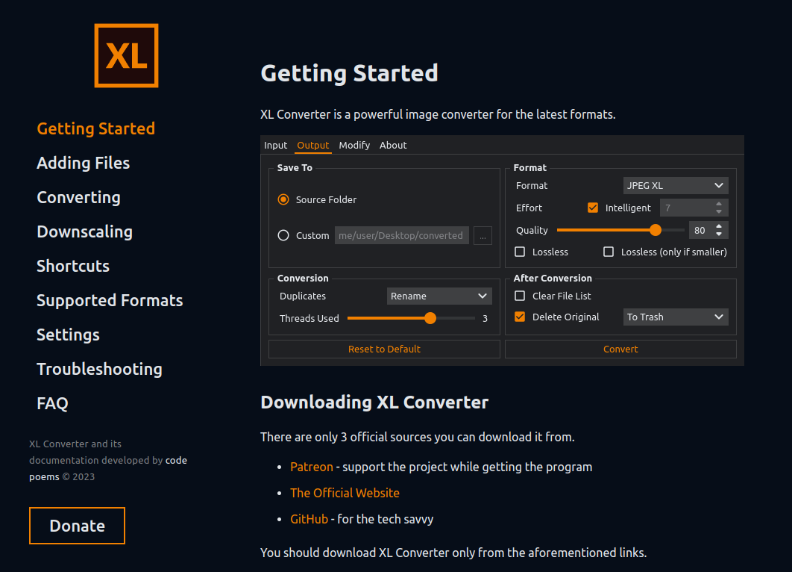
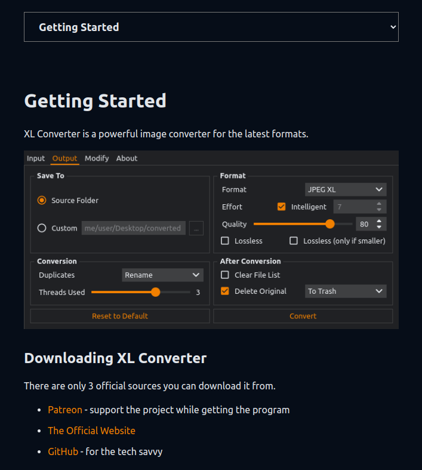

## XL Converter Documentation

The knowledge base for [XL Converter](https://github.com/JacobDev1/xl-converter) - a powerful image converter I wrote.

Hosted [here](https://xl-converter-docs.codepoems.eu).



|Laptops|Mobiles|
|:-:|:-:|
|||


Please, [donate](https://codepoems.eu/donate) to keep the project alive.

## Tech Stack

This website uses ReactJS, TypeScript, SASS, SWC and Vite.

## Running

```bash
npm i
npm run dev
```

## Deploying

```
npm run build
```

### Apache

Create a file named `.htaccess` with the following inside.

```
Options -MultiViews
RewriteEngine On
RewriteCond %{REQUEST_FILENAME} !-f
RewriteRule ^ index.html [QSA,L]
```

Then put it next to `index.html`.