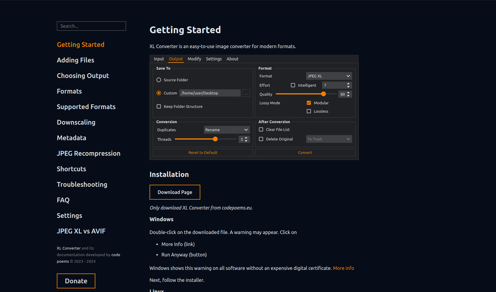
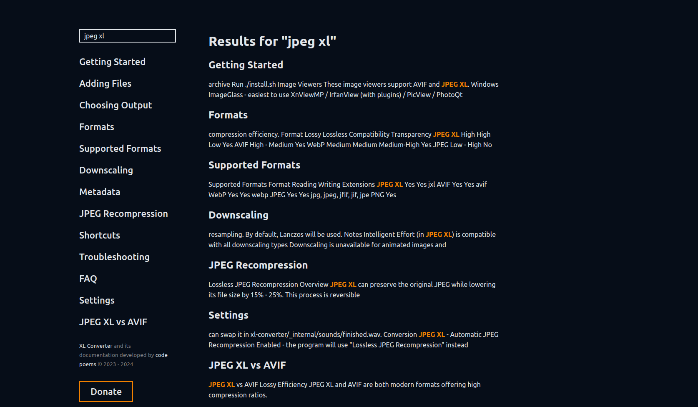

## XL Converter Documentation

The old documentation for [XL Converter](https://github.com/JacobDev1/xl-converter).

> ![IMPORTANT]
> This documentation has been deprecated and is no longer maintained.
> The new one is available [here](https://xl-docs.codepoems.eu/).



Features a search engine based on a local index.



## Running

Install [nvm](https://github.com/nvm-sh/nvm)

Use latest NodeJS LTS

```bash
nvm install --lts
```

Clone the repo.

```bash
git clone https://github.com/JacobDev1/xl-converter-docs.git
```

> [!TIP]
> If you need a specific version, use `git checkout <version_tag>`

Install packages and and run.

```bash
npm i
npm run dev
```

## Generating Search Index

The search index should be re-generated before deployment.

First, run the project.

```bash
npm i
npm run dev
```

Open another terminal and install Python.

```bash
sudo apt install python3 python3-pip python3-venv firefox
```

Create a venv.

```bash
make venv
source env/bin/activate
```

Finally, generate the search index.

```bash
make index
```

## Testing

```bash
make test
```

## Deploying

```
make build
```

### Apache

Create a file named `.htaccess` with the following inside.

```
Options -MultiViews
RewriteEngine On
RewriteCond %{REQUEST_FILENAME} !-f
RewriteRule ^ index.html [QSA,L]
```

Then put it next to `index.html`.